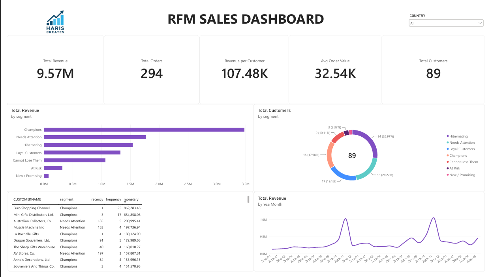

# RFM Sales Dashboard — Auto Sales Customer Segmentation

An end-to-end RFM (Recency, Frequency, Monetary) customer segmentation analysis built on auto sales transaction data, using **MySQL** for data cleaning and modeling, and **Power BI** for the final interactive dashboard.



---

## 📊 Project Overview

This project segments 89 customers across 294 orders into behavioral groups (Champions, Loyal Customers, At Risk, Hibernating, etc.) based on how recently, how often, and how much they purchase — a classic marketing analytics technique used to prioritize retention and re-engagement efforts.

**Dataset:** Auto Sales transaction data (2,747 rows, 20 columns, Jan 2018 – May 2020)

---

## 🛠️ Tech Stack

- **MySQL Workbench** — data cleaning, transformation, and RFM scoring logic
- **Power BI Desktop** — data modeling, DAX measures, and dashboard visualization

---

## 🧹 Data Cleaning & Preparation

- Imported raw CSV into MySQL schema `auto_sales_rfm`, table `sales_data`
- `ORDERDATE` was stored as text in `DD/MM/YYYY` format — converted to a proper `DATE` column (`order_date_clean`) using `STR_TO_DATE`
- Created `sales_clean` view, excluding orders with `Cancelled` status to avoid skewing revenue/frequency metrics

---

## 📐 RFM Methodology (SQL Views)

| View | Purpose |
|---|---|
| `sales_clean` | Base cleaned transactions (cancelled orders excluded) |
| `rfm_base` | Per-customer Recency, Frequency, and Monetary values calculated from clean transactions |
| `rfm_scores` | Each customer scored 1–5 per RFM dimension using `NTILE()` — Recency ranked descending (most recent = best score), Frequency & Monetary ranked ascending |
| `rfm_segments` | Customers bucketed into named segments (Champions, Loyal Customers, New/Promising, At Risk, Cannot Lose Them, Needs Attention, Hibernating) via `CASE` logic on combined RFM scores |

---

## 📈 Power BI Dashboard

**File:** `Auto_Sales_RFM_Dashboard.pbix`
Connected to MySQL via Connector/NET (Import mode), pulling in `sales_clean` and `rfm_segments`.

**Data Model:**
- Custom `DateTable` (2018–2020) with Year, MonthName, MonthNo, YearMonth columns, marked as the official date table
- Relationships: `DateTable → sales_clean` (on date), `rfm_segments → sales_clean` (on `CUSTOMERNAME`)
- 7 DAX measures in a dedicated `_Measures` table: Total Revenue, Total Orders, Total Customers, Avg Order Value, Revenue per Customer, Avg Recency, Avg Frequency

### Executive Overview Page

| KPI | Value |
|---|---|
| Total Revenue | 9.57M |
| Total Orders | 294 |
| Total Customers | 89 |
| Revenue per Customer | 107.48K |
| Avg Order Value | 32.54K |

**Visuals:**
- Total Revenue by Segment (bar chart)
- Total Customers by Segment (donut chart)
- Top 10 Customers table (ranked by monetary value)
- Total Revenue trend by Month (line chart, chronologically sorted)
- Country slicer for interactive filtering

---

## 🔑 Key Insights

- **Champions** drive the largest share of revenue despite not being the largest segment by customer count
- A meaningful portion of customers fall into **Needs Attention** and **Hibernating** — clear targets for re-engagement campaigns
- Revenue shows sharp seasonal spikes rather than a steady trend, suggesting bulk/wholesale order patterns

---

## 📁 Repo Structure

```
├── sql/                        # RFM SQL scripts (views, scoring, segmentation)
├── Auto_Sales_RFM_Dashboard.pbix
├── dashboard_preview.png
└── README.md
```

---

## 👤 Author

**Muhammad Haris**
